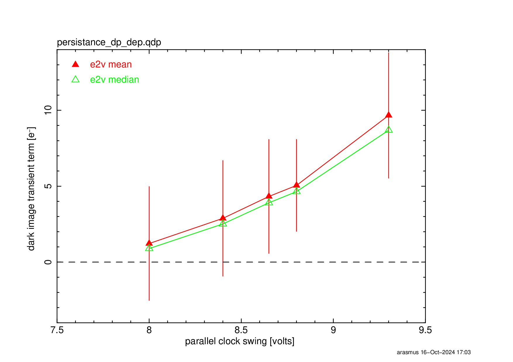

Persistence optimization
############################################

Leftover signal in the following darks after a blast of illumination has been observed. It is called "Persistence". 
Persistence has been observed in an early prototype E2V sensor as early as 2014 ([Doherty et al. 2014]_). It was confirmed that the amplitude of the persistence decreased as the parallel swing voltage got smaller. This is consistent with the Residual Surface Image [Janesick 2001]_ -- the excessive charges are being stuck at the surface layer. The level of persistence is about 10--20 ADU, and the decaying time constant is about 30sec.

During the EO testing in 2021, we also found the persistence made a streak toward the readout direction from the place where the bright spot located in a previous image. We call this trailling persistecnce.

E2V sensors have another major problem so-called "tearing", which is considered as the consequence of the non-uniform distribution of holes. Our primary focus in the opimization was given to mitigate the tearing over years and we have successfully elminate the tearing by bringing the e2v voltage from the unipolar voltage (both parallel rails high and low are posititve) to the bipolar voltage (the parallel high is positive and the low is negative) following the formula defined in the [the original e2v voltage formula]_. However, the persistence issue still remained unchanged.

For the persistence issue, if this is the residaul surface image, two approaches could be taken as discussed in [Utsumi et al. 2024]_. Either 1) establishing the pinning condition where the holes make a thin layer at the front surface so to get excessive charges recombined with the holes. or 2) narrowing the parallel swing so not to get the accumulated charges in the silicon don't get close to the surface state. 

The pinning condition could be established by bringing the parallel low voltage down as low as -7V or lower. The transition voltage needs to be empirically determined. However, E2V pointed out the measured current flow increases as the parallel low voltage goes low, which increases the risk of damaging the sensor by making a breakdown [1]_. Also, The excessive charges could get recombined by the thin layer of the holes, which could disturb the linearity at the high flux end whhere charges start to intaract with the holes. 

The parallel swing determines the fullwell. Depending on whether the accumulated charges spread over the columns or interact with the surface layer, there are blooming fullwell regime and the surface fullwell regime. The fullwell between these two regime is considered as the optimal fullwell [Janesick 2001]_, where we don't have persistence and as high dynamic range as possible. Seeing the persistence, we likely operate the sensor in the surface fullwell condition and we need to go to narrower voltage to get the blooming fullwell or the optimal fullwell. The obvious downside is to narrow the fullwell. 

The voltages are defined relative to each other. Changing the parallel swing (for example) also requires changes all other voltages to operate the sensor properly, for example properly reset the amplifier. The initial voltage was given in [the original e2v voltage formula]_ but to go to the narrow voltage we had to switch to [the new e2v voltage formula]_. 

[Snyder et al.]_, set up the a single sensor test-stand at UC Davis. They attempted multiple different approaches aformetioned above and reported the result in [Davis testing]_. The sumamry is as follows
- The new voltages following the rule work fine. 
- Narrowing the parallel swing eliminates the persistence
- Lowering the parallel low voltage didn't seem to work as we expect, the going further negative voltage is probably needed.
Note that the UCD setup didn't show up the persistence. It might be due to the characteristic of the sensor, might be due to the difference in the electronics (the long cable between CCD and REB, for example). They need to move the parallel rails up 

Based on this test result, we decided to try out the new voltage with the narrower voltage swing on the main Camera focal-plane. Keeping the parallel low voltage at -6V in order to operate the sensor safely (very conservative limit), we change the parallel swing voltage from 9.3V to 8.0V as well as all the other voltages using the new formula. We overexposed CCDs and took 20 darks after.
The image shown below is mean or median of pixel-by-pixel difference between the first and the last dark exposures, as a function of the parallel swing. As the parallel swing is lowered, the residual signal becomes small, it becomes rougly 10 times lower than the orignal 9.3V. Although we sampled mid points between 8.0 and 9.3V, 8.0V appears to work the best and it could be lower with the penalty of loosing the full well.

- impact on persistence
- impact on full-well
- impact on other parameters

.. [1] We note that ITL operates at the parallel low voltage of -8V. We have observed the increased current flow. But we have the software protection so that the current flow goes too high. 
.. [Janesick 2001] https://www.spiedigitallibrary.org/ebooks/PM/Scientific-Charge-Coupled-Devices/eISBN-9780819480392/10.1117/3.374903
.. [Doherty et al. 2014] https://ui.adsabs.harvard.edu/abs/2014SPIE.9154E..18D/abstract
.. [the original e2v voltage formula] https://github.com/lsst-camera-dh/mkconfigs/blob/master/newformula.py
.. [Utsumi et al. 2024] https://ui.adsabs.harvard.edu/abs/2024SPIE13103E..0WU/abstract
.. [the new e2v voltage formula] https://github.com/lsst-camera-dh/e2v_voltages/blob/main/setup_e2v_v4.py
.. [Snyder et al. 2024] https://ui.adsabs.harvard.edu/abs/2024SPIE13103E..21S/abstract and 
.. [Davis testing] https://docs.google.com/document/d/1V4o9tzKBLnI1nlOlMFImPko8pDkD6qE7jzzk-duE-Qo/edit?tab=t.0#heading=h.frkqtvvyydkr
